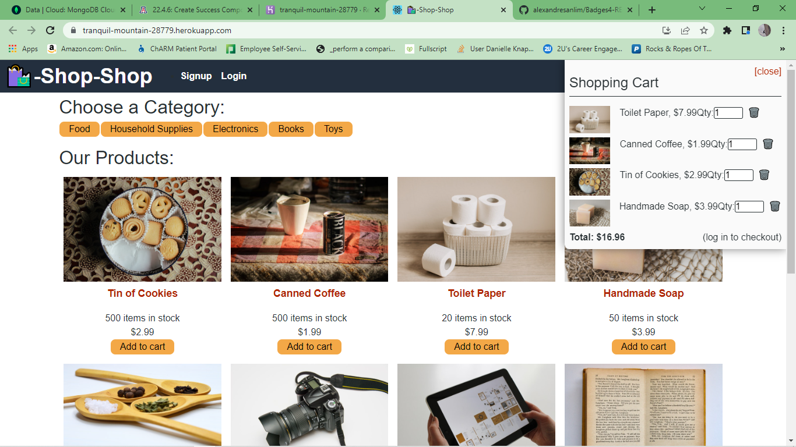

# Shop-Shop

 

# Description
Shop-Shop is a web application that allows users to find an purchase store items online.

## Table of Contents
  * [Technologies](#technologies)
  * [Usage](#usage)
  * [Link](#link)
  * [Credits](#credits)

## Technologies used
- Node.js
- Express.js
- MongoDB
- Mongoose
- GraphQL
- Apollo
- JWT
- React
- React Router
- Stripe API

## Usage
1. Visit the application by following the link provided below in the Link section.
2. The homepage of the application lists all the current products in the online store.
3. Users can add items to a shopping cart. Quanitities can be changed within the cart as well as removed, the total of the products is also listed within the shopping cart
4. Users must login/signup in order to checkout 

## Link
Click on the link below to visit the Rocks and Ropes Application:  
[Go to app](https://tranquil-mountain-28779.herokuapp.com/)

## Credits
[Elle Knapp](https://github.com/dmknapp2385)  
The University of Arizona Bootcamp